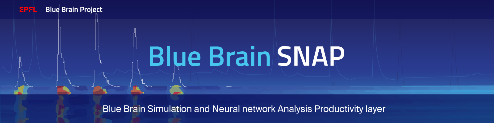

|banner|

|build_status| |license| |coverage| |docs|

Blue Brain SNAP
===============

Blue Brain Simulation and Neural network Analysis Productivity layer (Blue Brain SNAP).

Blue Brain SNAP is a Python library for accessing BlueBrain circuit models represented in
`SONATA <https://github.com/AllenInstitute/sonata/blob/master/docs/SONATA_DEVELOPER_GUIDE.md>`__ format.

Installation
------------

Blue Brain SNAP can be installed using ``pip``::

   pip install bluepysnap

Usage
-----

There are two main interface classes provided by Blue Brain SNAP:

|circuit| corresponds to the *static* structure of a neural network, that is:

- node positions and properties,
- edge positions and properties, and,
- detailed morphologies.

|simulation| corresponds to the *dynamic* data for a neural network simulation, including:

- spike reports,
- soma reports, and,
- compartment reports.

Most of Blue Brain SNAP methods return `pandas <https://pandas.pydata.org>`__ Series or DataFrames,
indexed in a way to facilitate combining data from different sources (that is, by node or edge IDs).

Among other dependencies, Blue Brain SNAP relies on Blue Brain Project provided libraries:

- `libsonata <https://github.com/BlueBrain/libsonata>`__, for accessing SONATA files
- `NeuroM <https://github.com/BlueBrain/NeuroM>`__, for accessing detailed morphologies

Tools
-----

Blue Brain SNAP also provides a SONATA circuit validator for verifying circuits.

The validation includes:

- integrity of the circuit config file.
- existence of the different node/edges files and ``components`` directories.
- presence of the "sonata required" field for node/edges files.
- the correctness of the edge to node population/ids bindings.
- existence of the morphology files for the nodes.

This functionality is provided by either the cli function:

.. code-block:: shell

    bluepysnap validate my/circuit/path/circuit_config.json

Or a python free function:

.. code-block:: python3

    from bluepysnap.circuit_validation import validate
    errors = validate("my/circuit/path/circuit_config.json")

Acknowledgements
----------------

The development of this software was supported by funding to the Blue Brain Project, a research center of the École polytechnique fédérale de Lausanne (EPFL), from the Swiss government’s ETH Board of the Swiss Federal Institutes of Technology.

This project/research has received funding from the European Union’s Horizon 2020 Framework Programme for Research and Innovation under the Specific Grant Agreement No. 785907 (Human Brain Project SGA2).

The Blue Brain Project would like to thank `Dr Eilif Muller <https://github.com/markovg>`_, the author of the precursor to Blue Brain SNAP, for his invaluable insights and contributions

License
-------

Blue Brain SNAP is licensed under the terms of the GNU Lesser General Public License version 3,
unless noted otherwise, for example, external dependencies.
Refer to `COPYING.LESSER <https://github.com/BlueBrain/snap/blob/master/COPYING.LESSER>`__ and
`COPYING <https://github.com/BlueBrain/snap/blob/master/COPYING>`__ for details.

Copyright (c) 2019-2021 Blue Brain Project/EPFL

This program is free software: you can redistribute it and/or modify
it under the terms of the GNU Lesser General Public License version 3
as published by the Free Software Foundation.

This program is distributed in the hope that it will be useful,
but WITHOUT ANY WARRANTY; without even the implied warranty of
MERCHANTABILITY or FITNESS FOR A PARTICULAR PURPOSE.  See the
GNU Lesser General Public License for more details.

You should have received a copy of the GNU Lesser General Public License
along with this program.  If not, see <https://www.gnu.org/licenses/>.

.. |build_status| image:: https://travis-ci.com/BlueBrain/snap.svg?branch=master
   :target: https://travis-ci.com/BlueBrain/snap
   :alt: Build Status

.. |license| image:: https://img.shields.io/pypi/l/bluepysnap
                :target: https://github.com/BlueBrain/snap/blob/master/COPYING.LESSER

.. |coverage| image:: https://codecov.io/github/BlueBrain/snap/coverage.svg?branch=master
   :target: https://codecov.io/github/BlueBrain/snap?branch=master
   :alt: codecov.io

.. |docs| image:: https://readthedocs.org/projects/bluebrainsnap/badge/?version=latest
             :target: https://bluebrainsnap.readthedocs.io/
             :alt: documentation status

.. substitutions

.. |circuit| replace:: **Circuit**
.. |simulation| replace:: **Simulation**
